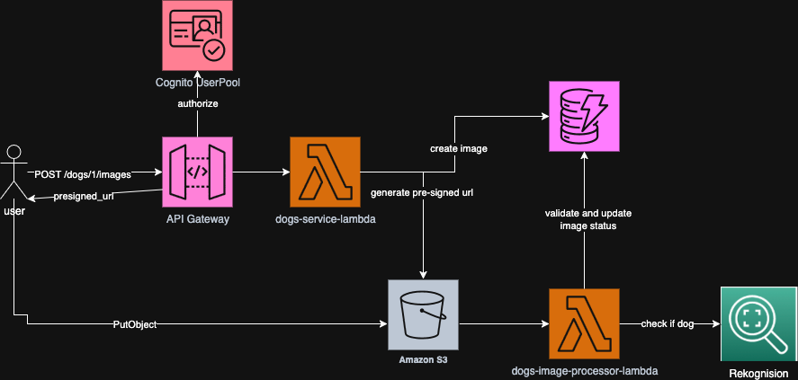

# My Dogs Project

A serverless application for managing dog profiles and image uploads built with AWS SAM (Serverless Application Model). This project consists of a backend service that provides REST APIs for dog management and automated image processing capabilities.

## Overview

The My Dogs project is a modern serverless application that allows users to:
- Create and manage dog profiles
- Upload images for their dogs with automated processing
- Retrieve dog information with associated images

The application is built using AWS serverless technologies including Lambda, API Gateway, DynamoDB, and S3, providing a scalable and cost-effective solution for pet management.

## Architecture



The architecture consists of:
- **Frontend Client**: Web/mobile application for user interactions
- **API Gateway**: RESTful API endpoints for dog and image management
- **Lambda Functions**: Serverless compute for business logic and image processing
- **DynamoDB**: NoSQL database for storing dog profiles and metadata
- **S3**: Object storage for dog images with event-driven processing

## Project Structure

```
my-dogs/
├── README.md                 # This file - project overview
├── PLAN.md                   # Project planning and roadmap
├── dogs-client/              # Frontend application (future)
│   └── TODO.md
└── dogs-service/             # Backend serverless service
    ├── README.md             # Detailed service documentation
    ├── template.yaml         # SAM CloudFormation template
    ├── dogs_service_lambda/  # Main API Lambda function
    ├── dogs_image_processor_lambda/  # Image processing Lambda
    ├── layers/common/        # Shared Lambda layer
    ├── tests/                # Unit and integration tests
    ├── events/               # Sample event files for testing
    └── docs/                 # Architecture diagrams and documentation
```

## Getting Started

### Prerequisites

- AWS CLI configured with appropriate permissions
- AWS SAM CLI installed
- Python 3.13
- Docker (for local development)

### Quick Start

1. **Clone the repository**
   ```bash
   git clone <repository-url>
   cd my-dogs
   ```

2. **Deploy the backend service**
   ```bash
   cd dogs-service
   sam build
   sam deploy --guided
   ```

3. **Test the deployment**
   ```bash
   # Get the API endpoint from SAM outputs
   export API_BASE_URL="https://your-api-id.execute-api.region.amazonaws.com/Prod"
   
   # Health check
   curl -X GET "$API_BASE_URL/health"
   ```

## Features

### Current Features (Backend Service)
- ✅ REST API for dog profile management
- ✅ Secure image upload with presigned URLs
- ✅ Automated image processing on S3 events
- ✅ Event-driven architecture with Lambda functions
- ✅ Shared Lambda layer for common utilities
- ✅ Comprehensive logging and tracing
- ✅ Local development setup with LocalStack

### Planned Features
- 🔄 Frontend web application
- 🔄 User authentication and authorization
- 🔄 Image processing and optimization
- 🔄 Advanced search and filtering
- 🔄 Mobile application

## Documentation

For detailed technical documentation, API usage examples, and development guides, see:

**[📖 Backend Service Documentation](dogs-service/README.md)**

The backend service documentation includes:
- Complete API reference with curl examples
- Architecture details and data flow
- Environment configuration
- Local development setup
- Testing instructions
- Deployment guide

## Technology Stack

- **Backend**: AWS Lambda (Python 3.13), API Gateway, DynamoDB, S3
- **Infrastructure**: AWS SAM, CloudFormation
- **Development**: LocalStack, pytest, AWS Powertools
- **Observability**: CloudWatch Logs, X-Ray tracing

## Contributing

1. Fork the repository
2. Create a feature branch
3. Make your changes
4. Add tests for new functionality
5. Ensure all tests pass
6. Submit a pull request

## License

This project is licensed under the MIT License - see the LICENSE file for details.
